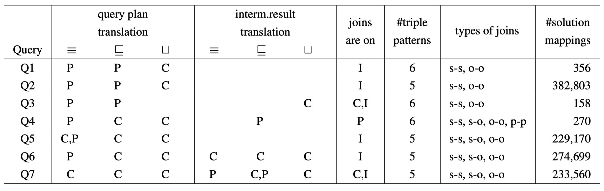

# HeFQUIN-VocabMappingsExperiments
This repository contains artifacts related to the experiments for the paper ‘Considering Vocabulary Mappings in Query Plans for Federations of RDF Data Sources’ ([download camera-ready version](https://www.ida.liu.se/~sijch63/files/vocabMapping_CoopIS2023.pdf)). 

The complete resources can be downloaded from [Zenodo](https://doi.org/10.5281/zenodo.8114487).

## Datasets
The datasets utilized in our evaluation are generated using the dataset generator of the [Lehigh University Benchmark (LUBM)](http://swat.cse.lehigh.edu/projects/lubm/). For the evaluation, we generated data for ten universities and split them into ten separate datasets (one per university). 

Scripts that are used to generate all datasets can be found in the folder [datasets](https://github.com/LiUSemWeb/HeFQUIN-VocabMappingsExperiments/tree/main/datasets). 
You can also download generated datasets directly from the [Zenodo](https://zenodo.org/record/8114487) under the directory **datasets**.

## Federations
We provide three federations for the evaluation (each of them consists of ten federation members):
- Fed0: all federation members use the global vocabulary;
- Fed1: all federation members use the same local vocabulary, which is different from the global vocabulary;
- Fed2: each federation member uses a different local vocabulary.

To set up each federation, the detailed instructions and configuration files can be found under the directory **federations** (e.g., [Fed0](https://github.com/LiUSemWeb/HeFQUIN-VocabMappingsExperiments/tree/main/federations/fed0)).

## Queries
We designed seven benchmark queries that are expressed in terms of the global vocabulary, and can be used for all three federations. 
These queries differ regarding the types of vocabulary mapping rules that are relevant to them, both in the context of the mapping-based rewriting of the initial query plans and in the context of the translation of intermediate results.

You can find all the queries in the folder of [queries](https://github.com/LiUSemWeb/HeFQUIN-VocabMappingsExperiments/tree/main/queries).

## Experiments
To execute an experiment, a federation needs to be set up first, then use our HeFQUIN engine as the test driver, and call it via a shell script.
The latest implementation of the HeFQUIN engine can be found in the [Github repository](https://github.com/LiUSemWeb/HeFQUIN).

For the evaluation of this paper, we use compilable JAR files for the HeFQUIN engine, which you can find in the [experiments](https://github.com/LiUSemWeb/HeFQUIN-VocabMappingsExperiments/tree/main/experiments) directory.

### Results
We also include an analysis of the experiment results, including query execution time and query planning time, in the [resultsAnalysis](https://github.com/LiUSemWeb/HeFQUIN-VocabMappingsExperiments/tree/main/resultsAnalysis) directory. 
If you are interested in the original log files, all these row data can be downloaded from the **experiments** directory on [Zenodo](https://doi.org/10.5281/zenodo.8114487).
